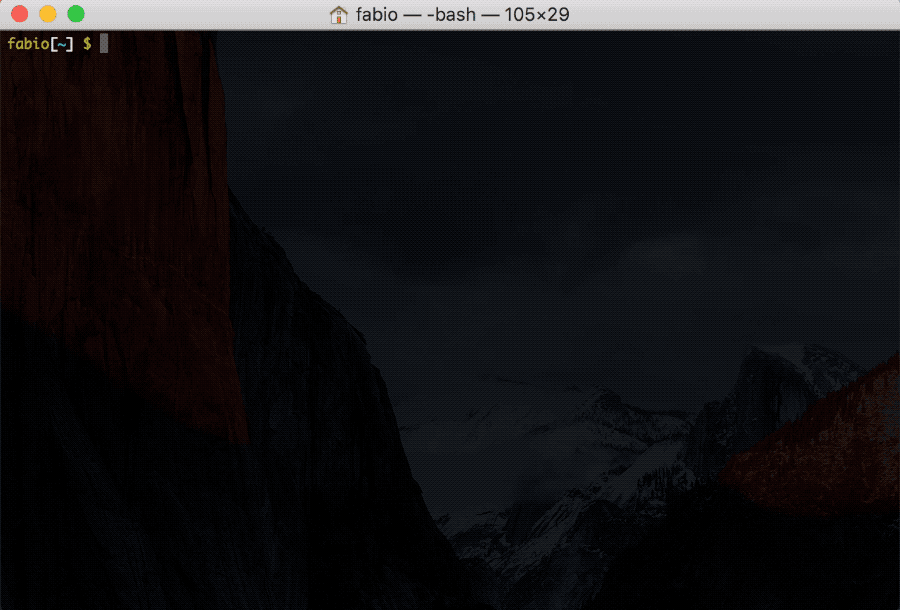

# CLI

Using the provided Command Line Interface you can create new projects from templates and list/install/uninstall/update templates.

## Wizard

If you just run `template` without any arguments or options a very user-friendly wizard will be shown, you can use it to execute commands. It will provide a list of commands and templates to choose from and ask for any input it needs.

## Commands

You can also call specific commands directly, here's a list of those available:

### `$ template create <template> [project]`

Create `[project]`, in the current working directory, using `<template>`. If `[project]` is not provided it will default to `my-{name-of-the-template}`.

### `$ template list`

List all installed templates.

### `$ template install <repository> [template]`

Install a template named `[template]` from the `<repository>`.

A repository can be many things:
  - **A Git endpoint**: https://github.com/fabiospampinato/template-typescript-package.git
  - **A GitHub repository**: https://github.com/fabiospampinato/template-typescript-package
  - **A GitHub repository shorthand**: fabiospampinato/template-typescript-package
  - **A path to a local folder**: /path/to/template

If `[template]` is not provided it will default to the name of the repository, minus the eventual `template-` prefix.

### `$ template uninstall [template]`

Uninstall `[template]`. If `[template]` is not provided it will ask you if you want to uninstall all templates.

### `$ template update [template]`

Update `[template]`. If `[template]` is not provided it will update all templates.
