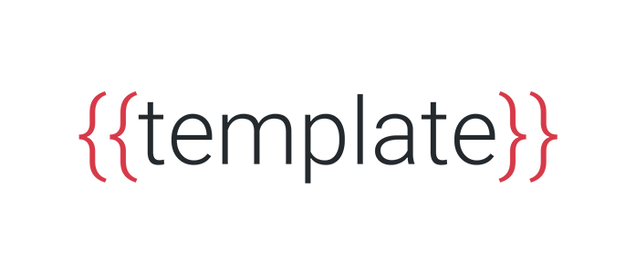

<p align="center">
  
</p>

A super-simple way to create new projects based on templates.

Inspired by [Khaos](https://github.com/segmentio/khaos), but with a better CLI, schemas and a more up-to-date code.

## Install

```sh
npm install -g @fabiospampinato/template
```

## Documentation

- [Template](https://github.com/fabiospampinato/template/blob/master/docs/template.md): What's a template and how to make one.
- [Schema](https://github.com/fabiospampinato/template/blob/master/docs/schema.md): What's a schema and how to use it to improve your templates.
- [CLI](https://github.com/fabiospampinato/template/blob/master/docs/cli.md): List of provided commands and how to use them.

## Usage

First of all you've got to install a template, for example let's install [fabiospampinato/template-typescript-package](https://github.com/fabiospampinato/template-typescript-package) as the `typescript-package` template:

```sh
template install fabiospampinato/template-typescript-package typescript-package
```

Now you should have that downloaded locally under your `~/.template` directory. You may also put templates there manually, if you don't feel like creating a public repository for them.

It's time to use the newly installed template to create a new project called `my-package`:

```sh
template create typescript-package my-package
```

Now it will ask you to provide values for the placeholders found inside the template:

```sh
name: my-package
description: This is a description
version: 1.0.0
author: Fabio Spampinato
owner: fabiospampinato
email: spampinabio@gmail.com
scoped: No
```

And that's it, inside the `my-package` directory you'll have everything you need to get you started.

## How it works

This program simply takes a folder containing some files as input, parses those files using [handlebars](http://handlebarsjs.com), and then just outputs them to your desired folder. The file structure inside the template is left untouched.

Read more about templates [here](https://github.com/fabiospampinato/template/blob/master/docs/template.md).

## License

MIT © Fabio Spampinato
